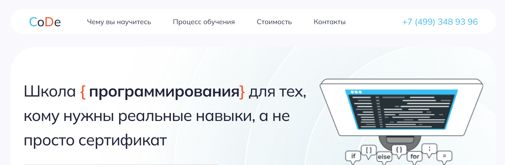
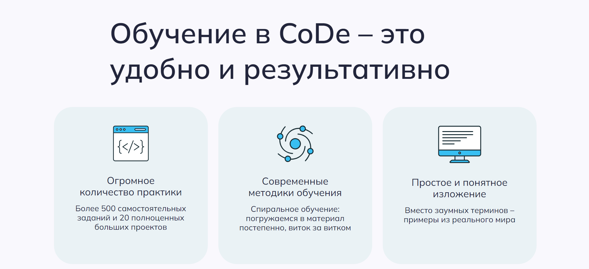
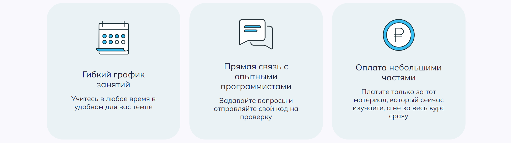
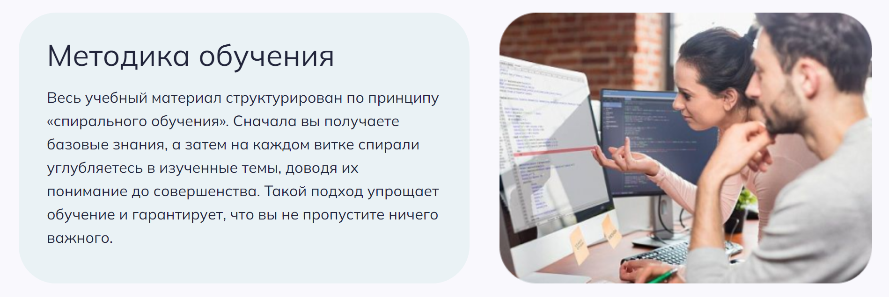
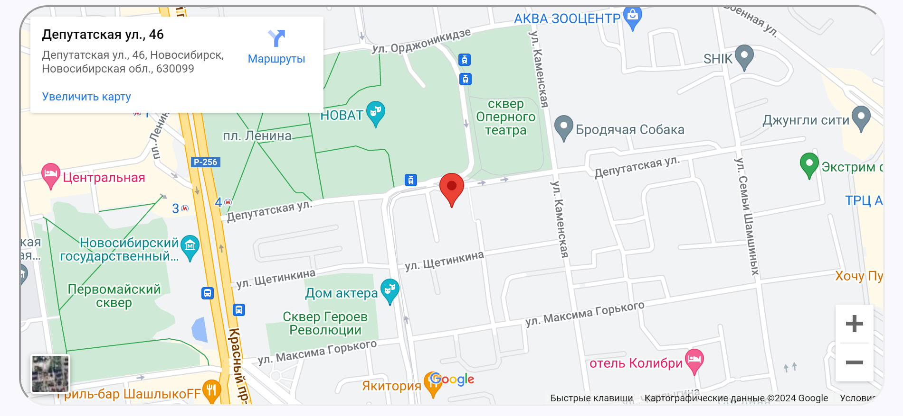
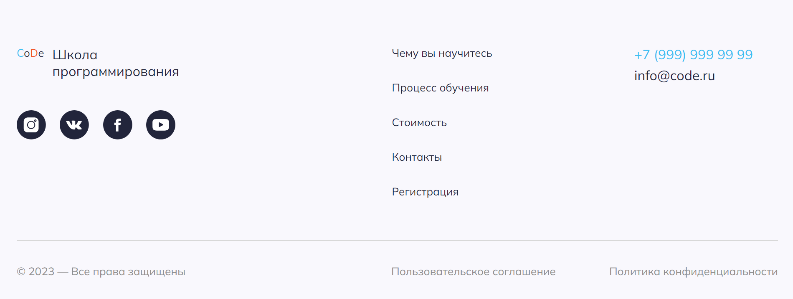

##### Верстка лендинга для тестового задания

##### Ссылка на GitHub Pages: https://elboyko.github.io/Kontur/

---

##### Используемые инструменты:

1. Html разметка
2. стили CSS
3. адаптив
4. бургер-меню, слайдер и google-карта

---

